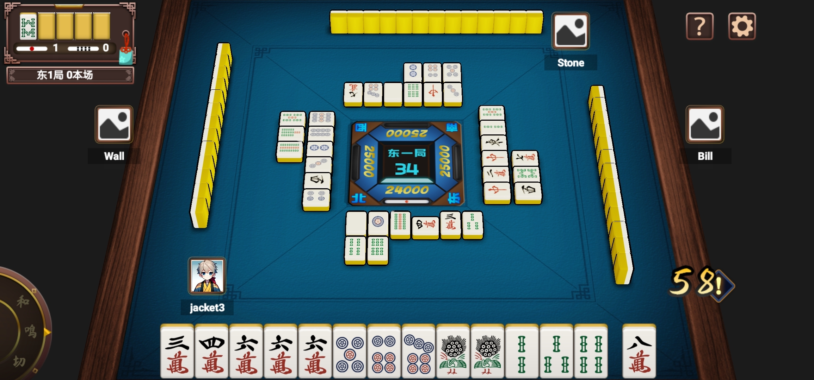
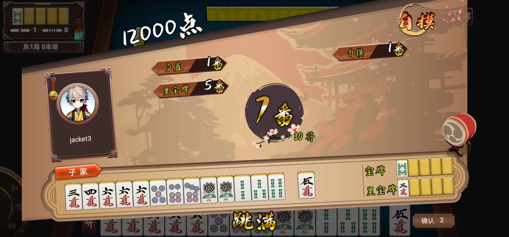

<p align="center">
  <strong>欢迎来到口袋麻将全集。本项目使用最新cocos creator开发，全新3D场景体验，typescript语言，支持热更，跨平台支持，支持网页版。</strong>
  
</p>


## 项目宗旨

目标：打造公平、公正、公开的开源麻将游戏平台。目前，我们已经完成了日本麻将的开发。更多的麻将玩法正在开发中。

我们希望通过开源，让更多人参与到项目中，并使游戏开发者从中获益。任何人/团队均可以快速定制自己的版本，让我们一起参加到项目中吧。


## 任务悬赏

让项目更加有活力，因此出一些悬赏任务，有意者邮箱联系，任何想法都可以联系我们：

1.场景过渡优化，加载优化 ，悬赏金额：1000RMB

2.增加台湾玩法，悬赏金额：5000RMB

......


## 测试地址

http://magame.110x.com


## 麻将规则

开发的规则，可参考下面的文档：[mahjongdoc](https://github.com/openpokergame/MahjongRules)


## 使用教程

推荐使用cocos creator 3.7.4引擎，或者最新的引擎打开，并选择main场景作为第一个启动场景(第一个场景做了一些初始化的工作)，打开creator直接运行就行，有疑问，请加群。


## 获取源码

```
git clone https://github.com/openpokergame/PocketMahjongClient.git
```


## 版本说明

- master 分支：稳定版本，已通过测试


## 交流 & FAQ

qq群：363029515

官网：http://qipaiplay.com

博客：http://www.xgeplayer.com

email：openpokerorg@gmail.com


## 免责声明

严禁用于任何非法用途，后果自负


## 更多游戏截图

大厅-->


房间-->


结算 -->


